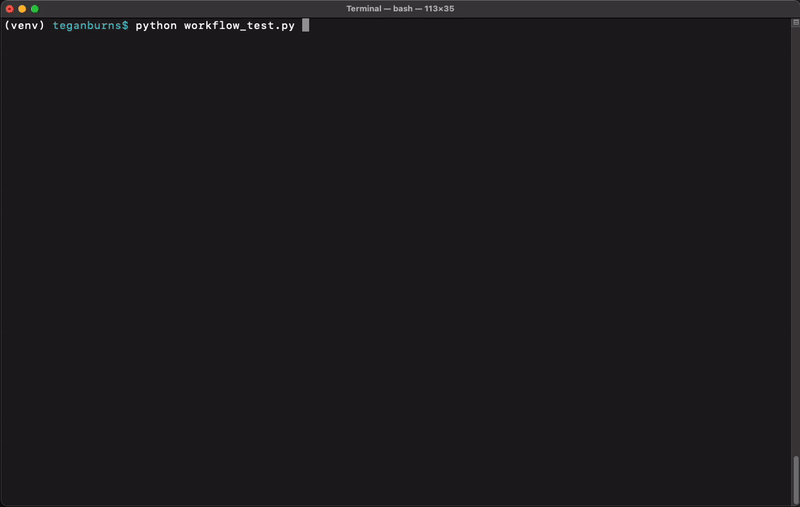

# AI Observer

A Flask-based web application that provides an interface for AI observation and interaction. The application includes a dashboard, special routes for AI interaction, and landing page functionality.

## Features

- Web-based dashboard interface
- Video capture device integration
- OpenAI integration
- Special route handling for AI interactions
- Logging and monitoring capabilities
- RESTful API endpoints

## Workflow Demonstration

Below is a demonstration of the AI Observer workflow:



The workflow test (`workflow_test.py`) demonstrates the complete video capture and processing pipeline:

1. Captures a frame from the video device via the `/capture` endpoint
2. Verifies the frame exists in recent captures
3. Sends the frame to ChatGPT for analysis via `/send_request`
4. Verifies the frame is properly archived
5. Tests frame deletion functionality
6. Confirms proper cleanup of archived frames

Each step includes progress indicators and comprehensive error handling to ensure the system is functioning as expected.

## Prerequisites

- macOS
- Python 3.x
- Virtual environment (recommended)
- OpenAI API key (for AI features)
- MongoDB (installed and running locally)
- Video capture device (e.g., webcam, capture card)

## Installation

1. Clone the repository:
   ```bash
   git clone https://github.com/teganburns/AI-Observer.git
   cd AI-Observer
   ```

2. Create and activate a virtual environment (recommended):
   ```bash
   python -m venv venv
   source venv/bin/activate
   ```

3. Install dependencies:
   ```bash
   pip install -r requirements.txt
   ```

4. Install and Start MongoDB:
   - Install MongoDB Community Edition using Homebrew:
     ```bash
     brew tap mongodb/brew
     brew install mongodb-community@7.0
     ```
   - Start the MongoDB service:
     ```bash
     brew services start mongodb/brew/mongodb-community@7.0
     ```

5. Create a `.env` file in the root directory and add your configuration:
   ```
   OPENAI_API_KEY=$OPENAI_API_KEY
   MONGODB_URI=mongodb://localhost:27017/  # Optional: defaults to this value if not set
   MONGODB_DB=ai_observer                  # Optional: defaults to this value if not set
   ```

Note: The MongoDB configuration will default to a local MongoDB instance at `mongodb://localhost:27017/` with database name `ai_observer` if not specified in the `.env` file.

## Project Structure

```
.
├── main.py              # Application entry point
├── config.py            # Configuration settings
├── routes/              # Route handlers
├── templates/           # HTML templates
├── static/             # Static files (CSS, JS, etc.)
├── utils/              # Utility functions
└── requirements.txt    # Project dependencies
```

## Usage

1. Start the server (make sure your virtual environment is activated):
   ```bash
   # Activate virtual environment if not already activated
   source venv/bin/activate
   
   # Start the Flask server
   python main.py
   ```
   The server will start in debug mode and should display a message indicating it's running on http://localhost:5001

2. Open your web browser and navigate to:
   ```
   http://localhost:5001
   ```
   You should see the AI Observer dashboard interface. The "Capture Frame" button will capture from your video device, and you can send the captured frames to ChatGPT for analysis.

## Testing the Setup

After starting the server, you can verify that all endpoints are working correctly by running the workflow test in a separate terminal:

1. Make sure you're in the project directory and the virtual environment is activated:
   ```bash
   cd AI-Observer  # if not already in the project directory
   source venv/bin/activate
   ```

2. Run the workflow test:
   ```bash
   python workflow_test.py
   ```

The test will run through the complete workflow:
- Video frame capture from your capture device
- Verification of database storage
- OpenAI API integration
- Image archival process
- Cleanup functionality

If all tests pass, your setup is working correctly. If any test fails, check the error message and verify your:
- Server is running on port 5001
- MongoDB service is active
- OpenAI API key is properly set
- Video capture device is connected and accessible

## Development

- The application runs in debug mode by default
- Logs are written to `server_debug.log`
- Configuration can be modified in `config.py`

## Dependencies

- Flask (>=3.0.0): Web framework
- OpenAI (>=1.12.0): AI integration
- OpenCV Python (>=4.8.0): Video capture and image processing
- Python-dotenv (>=1.0.0): Environment variable management
- PyMongo (>=4.6.0): MongoDB integration
- Python-dateutil (>=2.8.2): Date utilities
- Pillow (>=10.0.0): Image processing
- Requests (>=2.31.0): HTTP client library
- TQDM (>=4.66.2): Progress bar utilities


## License

[MIT License](LICENSE)

Copyright (c) 2025 Tegan Burns

Permission is hereby granted, free of charge, to any person obtaining a copy
of this software and associated documentation files (the "Software"), to deal
in the Software without restriction, including without limitation the rights
to use, copy, modify, merge, publish, distribute, sublicense, and/or sell
copies of the Software, and to permit persons to whom the Software is
furnished to do so, subject to the following conditions:

The above copyright notice and this permission notice shall be included in all
copies or substantial portions of the Software.

THE SOFTWARE IS PROVIDED "AS IS", WITHOUT WARRANTY OF ANY KIND, EXPRESS OR
IMPLIED, INCLUDING BUT NOT LIMITED TO THE WARRANTIES OF MERCHANTABILITY,
FITNESS FOR A PARTICULAR PURPOSE AND NONINFRINGEMENT. IN NO EVENT SHALL THE
AUTHORS OR COPYRIGHT HOLDERS BE LIABLE FOR ANY CLAIM, DAMAGES OR OTHER
LIABILITY, WHETHER IN AN ACTION OF CONTRACT, TORT OR OTHERWISE, ARISING FROM,
OUT OF OR IN CONNECTION WITH THE SOFTWARE OR THE USE OR OTHER DEALINGS IN THE
SOFTWARE. 